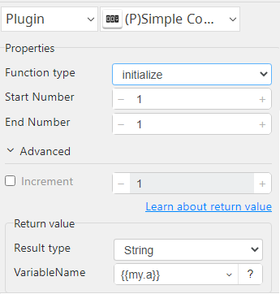
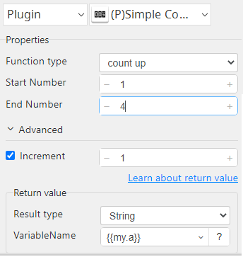
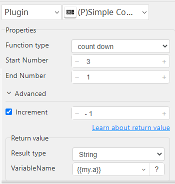

# Simple Counter

***The plugin is managing the "retry cycle" for errors and to minimize the number of operations to set it up.***

## Simple Counter
| Item         |             Value             |
|--------------|:-----------------------------:|
| Icon         |    |
| Display Name |      **Simple Counter**       |

### Arun Kumar (arunk@argos-labs.com)

* [email](mailto:arunk@argos-labs.com) 
 
## Version Control 
* [4.909.1314](setup.yaml)
* Release Date: `September 7, 2022`

## Input (Required)
| Function type      | Parameters    | Output        |
|--------------------|---------------|---------------|
| Initialize         | Start Number  | (Output Text) |
|                    | End Number    |               |
|                    | Increment     |               |
| Count Up           | Start Number  | (Output Text) |
|                    | End Number    |               |
|                    | Increment     |               |
| Count Down         | Start Number  | (Output Text) |
|                    | End Number    |               |
|                    | Increment     |               |

Note:-
1. Increment always positive with Count Up.
2. Increment always negative with Count Down.
3. Count Up always from 1 to 99.
4. Count Down always 99 to 1.
5. Start Number and End Number must be non-zero.
6. Start Number and End Number zero case of fail return code 1.

Use for retry cycle:-

Case: 1 - 99 (Count Up)

Step-1: choose To initialize Function type get Start Number (i.e. 1)

Step-2: choose Count Up Function type get Start Number updated(i.e. 2),with return code 0 JumpToOperation or JumpToStep

Step-3: At end of event (i.e. 100) and return code 1 case of fail or modifie it under return code section.

## Return Value

### Normal Case
Description of the output result

## Return Code
| Code | Meaning             |
|------|---------------------|
| 0    | Success             |
| 1    | Exceed retry cycle  |
| 99   | Exceptional case    |

## Output Format
You may choose one of 3 output formats below,

<ul>
  <li>String (default)</li>
  <li>CSV</li>
  <li>File</li>
</ul>  

## Parameter setting examples (diagrams)

## Operations

### Initialize:

### Count Up:

### Count Down:

