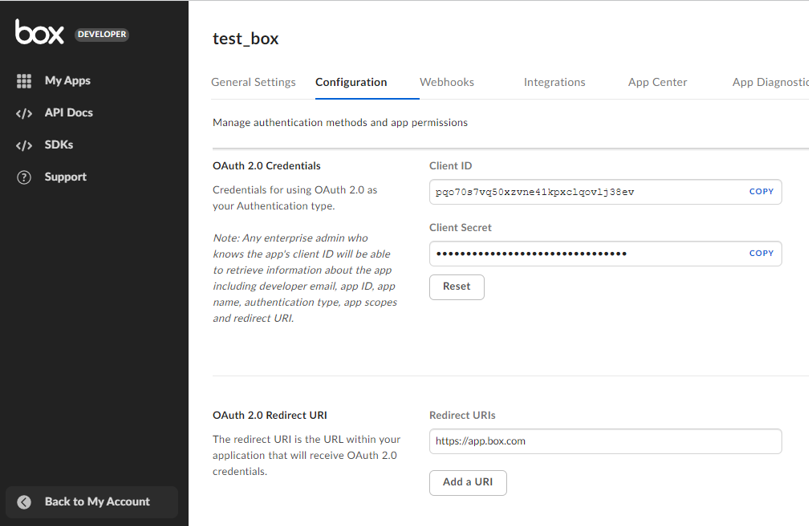

# Box II

***This plugin allows generating tokens from the box, showing a list of files, uploading files to the box, and downloading files from the box.***

## Box II
| Item         |          Value           |
|--------------|:------------------------:|
| Icon         |  |
| Display Name |        **Box II**        |

## Arun Kumar (arunk@argos-labs.com)

Arun Kumar
* [email](mailto:arunk@argos-labs.com) 
 
## Version Control 
* [4.721.1450](setup.yaml)
* Release Date: `July 21, 2022`

## Primary Features

Get the file/folder lists, upload and download the files from BOX

## Create credentials from Box console

1. Create apps in here: https://account.box.com/login?redirect_url=%2Fdevelopers%2Fconsole

2. Get the Client id, Client Secret and Redirect URI to get a token

Redirect URI 
<ul>
    <li>Don't have multiple redirections.</li>
    <li>Should be static or non-hosted.</li>
    <li>Must response quick.</li>
    <li>Some redirect URL should help</li>
    Eg:- https://www.google.com, https://example.com, http://app.mybox.com
</ul>

## Input (Required)
| Display Name          | Selection                | Default Value          |
|-----------------------|--------------------------|------------------------|
| Get Token             | Client ID, Client Secret | Token (str)            |
|                       | Redirect URI             |                        |
|                       | User ID                  |                        |
|                       | Password                 |                        |
| File/Folder Lists     | Client ID, Client Secret | type,id,name           |
|                       | Token                    |                        |
|                       | Folder ID                |                        |
| Upload Files          | Client ID, Client Secret | name,id                |
|                       | Token                    |                        |
|                       | Files to Upload          |                        |
|                       | Folder ID                |                        |
| Download Files/Folder | Client ID, Client Secret | (Downloaded file path) |
|                       | Token                    |                        |
|                       | Folder ID or File ID     |                        |
|                       | Output Path              |                        |

## Return Value

### Normal Case
Description of the output result

## Return Code
| Code | Meaning                      |
|------|------------------------------|
| 0    | Success                      |
| 1    | Failure (Invalid Input Type) |
| 99   | Exceptional case             |

## Output Format
You may choose one of 3 output formats below,

<ul>
  <li>String (default)</li>
  <li>CSV</li>
  <li>File</li>
</ul>  

## Parameter setting examples (diagrams)

## Operations

### Get Access Token:

### File/Folder Lists:

### Upload Files:

### Download Files/Folder:

